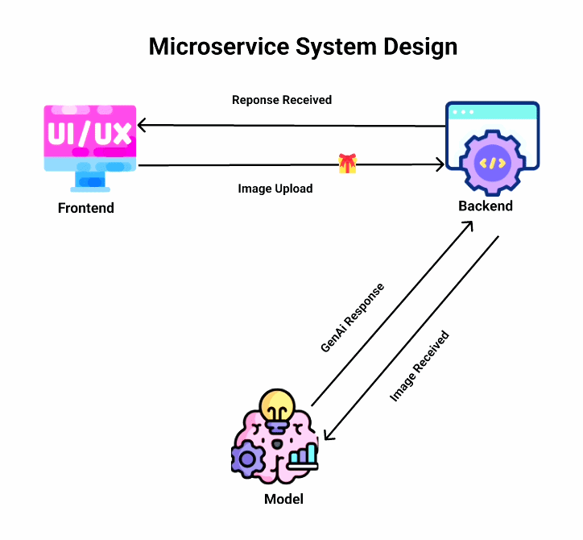
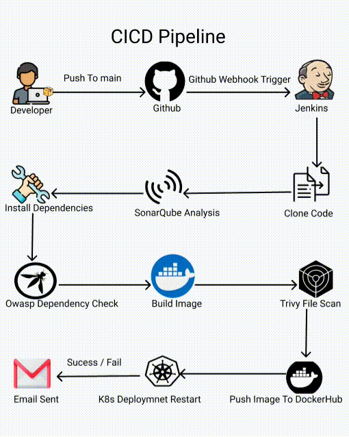

<div align="center">

# ✨ GlamAI — Frontend

### AI-Powered Face Analysis & Personalized Beauty Recommendations

<p>
  
  
  
  
  
  
</p>

<p>
  
  
  
  
</p>

<br />

> Upload a photo and discover your perfect look — powered by **68+ facial landmarks** detection and **RAG-based** personalized beauty recommendations.

<br />

</div>

---

## 📑 Table of Contents

- [Features](#-features)
- [System Design & Architecture](#-system-design--architecture)
- [Tech Stack](#-tech-stack)
- [CI/CD Pipeline](#-cicd-pipeline-jenkins)
- [Kubernetes Deployment](#-kubernetes-deployment)
- [Project Structure](#-project-structure)
- [Getting Started](#-getting-started)
- [Environment Variables](#-environment-variables)
- [Docker](#-docker)
- [Deploy to Kubernetes](#-deploy-to-kubernetes)
- [License](#-license)

---

## 🚀 Features

| Feature | Description |
|---|---|
| 🔍 **Facial Analysis** | Detects 68+ facial landmarks using AI |
| 💄 **Personalized Tips** | RAG-powered beauty & styling recommendations |
| 📸 **Drag & Drop Upload** | Intuitive image upload with validation |
| 🔐 **Authentication** | Secure login & signup with JWT |
| 💳 **Subscription Plans** | Tiered plans with usage tracking |
| 📱 **Responsive UI** | Fully responsive design with Tailwind CSS |

---

## 🏗 System Design & Architecture

<div align="center">
  
  <br />
  <em>▲ End-to-end system architecture — from user request to Kubernetes-orchestrated microservices</em>
</div>

<br />

<details>
<summary>📐 <strong>Architecture Diagram (Text)</strong></summary>
<br />

```
┌─────────────────────────────────────────────────────────────────────┐
│                        KUBERNETES CLUSTER (Kind)                    │
│                     1 Control Plane + 3 Workers                     │
│  ┌───────────────────────────────────────────────────────────────┐  │
│  │                    Namespace: glamai-ns                        │  │
│  │                                                               │  │
│  │  ┌──────────────────────────────────────────────────────────┐ │  │
│  │  │              NGINX Ingress Controller                     │ │  │
│  │  │         Host: 139.59.85.203.nip.io                       │ │  │
│  │  └──────┬──────────────┬──────────────┬─────────────────────┘ │  │
│  │         │ /            │ /server      │ /model                │  │
│  │         ▼              ▼              ▼                        │  │
│  │  ┌─────────────┐ ┌──────────┐ ┌─────────────┐                │  │
│  │  │  Frontend   │ │ Backend  │ │  ML Model   │                │  │
│  │  │  Service    │ │ Service  │ │  Service    │                │  │
│  │  │  (port 80)  │ │(port 3000│ │ (port 3000) │                │  │
│  │  └──────┬──────┘ └─────┬────┘ └──────┬──────┘                │  │
│  │         ▼              ▼              ▼                        │  │
│  │  ┌─────────────┐ ┌──────────┐ ┌─────────────┐                │  │
│  │  │  Frontend   │ │ Backend  │ │  ML Model   │                │  │
│  │  │ Deployment  │ │Deployment│ │ Deployment  │                │  │
│  │  │ (2-5 pods)  │ │          │ │             │                │  │
│  │  │   + HPA     │ │          │ │             │                │  │
│  │  └─────────────┘ └──────────┘ └─────────────┘                │  │
│  └───────────────────────────────────────────────────────────────┘  │
└─────────────────────────────────────────────────────────────────────┘
```

</details>

### Request Flow

1. User accesses the app via the **Ingress host URL**
2. **NGINX Ingress** routes traffic based on path:
   - `/` → Frontend (React + Nginx)
   - `/server/*` → Backend API (Node.js)
   - `/model/*` → ML Model Service (Python)
3. Frontend communicates with Backend via `/server/api` path
4. Backend orchestrates ML model calls for face analysis

---

## 🛠 Tech Stack

<table>
<tr>
<td valign="top" width="33%">

### Frontend
| Technology | Purpose |
|---|---|
| **React 19** | UI framework |
| **Redux Toolkit** | State management |
| **Tailwind CSS 4** | Utility-first styling |
| **Axios** | HTTP client |
| **Lucide React** | Icon library |
| **React Hot Toast** | Notifications |

</td>
<td valign="top" width="33%">

### Infrastructure
| Technology | Purpose |
|---|---|
| **Docker** | Multi-stage builds |
| **Kubernetes** | Orchestration |
| **NGINX** | Reverse proxy |
| **Jenkins** | CI/CD automation |
| **kubectl** | Deployment mgmt |

</td>
<td valign="top" width="33%">

### Security & Quality
| Tool | Purpose |
|---|---|
| **SonarQube** | Code analysis |
| **OWASP** | Dep vulnerability scan |
| **Trivy** | Image & FS scanning |

</td>
</tr>
</table>

---

## 🔄 CI/CD Pipeline (Jenkins)

The project uses a **fully automated Jenkins pipeline** with security scanning at every stage.

<div align="center">
  
  <br />
  <em>▲ Automated Jenkins pipeline — from code commit to Kubernetes deployment</em>
</div>

<br />

### Pipeline Stages

| # | Stage | Description |
|---|---|---|
| 1 | **Clone Code** | Pulls latest code from GitHub `main` branch |
| 2 | **SonarQube Analysis** | Runs static code analysis for bugs, code smells & vulnerabilities |
| 3 | **Quality Gate** | Blocks pipeline if code quality thresholds are not met |
| 4 | **OWASP Dependency Check** | Scans project dependencies against NVD for known CVEs |
| 5 | **Trivy FS Scan** | Scans file system for security issues |
| 6 | **Docker Build** | Multi-stage build → React app compiled → served by Nginx |
| 7 | **Trivy Image Scan** | Scans the built Docker image for vulnerabilities |
| 8 | **Push to DockerHub** | Pushes the verified image to DockerHub registry |
| 9 | **K8s Rollout Restart** | Triggers a rolling restart of the Kubernetes deployment |

<details>
<summary>📐 <strong>Pipeline Diagram (Text)</strong></summary>
<br />

```
┌──────────┐    ┌────────────┐    ┌──────────────┐    ┌──────────────┐
│  Clone   │───▶│ SonarQube  │───▶│   Quality    │───▶│    OWASP     │
│  Code    │    │  Analysis  │    │    Gate      │    │  Dep Check   │
└──────────┘    └────────────┘    └──────────────┘    └──────────────┘
                                                             │
       ┌─────────────────────────────────────────────────────┘
       ▼
┌──────────────┐    ┌──────────────┐    ┌──────────────┐    ┌──────────────┐
│  Trivy FS    │───▶│  Docker      │───▶│  Trivy       │───▶│  Push to     │
│  Scan        │    │  Build       │    │  Image Scan  │    │  DockerHub   │
└──────────────┘    └──────────────┘    └──────────────┘    └──────────────┘
                                                                    │
                                                                    ▼
                                                          ┌──────────────────┐
                                                          │  K8s Rollout     │
                                                          │  Restart         │
                                                          └──────────────────┘
```

</details>

### Post-Build Notifications

- ✅ **Success** — HTML email with build details and scan reports attached
- ❌ **Failure** — HTML email with failure logs and scan reports attached

---

## ☸ Kubernetes Deployment

### Cluster Configuration

| Component | Details |
|---|---|
| **Cluster Type** | Kind (Kubernetes in Docker) |
| **Kubernetes Version** | v1.34.2 |
| **Topology** | 1 Control Plane + 3 Worker Nodes |
| **Ingress** | NGINX Ingress Controller |
| **Namespace** | `glamai-ns` |

### K8s Resources

```
k8s/
├── 00_cluster.yml              # Kind cluster config (1 CP + 3 Workers)
├── namespace.yml               # glamai-ns namespace
├── 03_fortend_deployment.yml   # Frontend Deployment (2 replicas)
├── 04_fortend_service.yml      # Frontend ClusterIP Service (port 80)
├── hpa-fortend.yml             # HorizontalPodAutoscaler (2→5 pods)
└── ingress.yml                 # NGINX Ingress with path-based routing
```

### Horizontal Pod Autoscaler (HPA)

| Parameter | Value |
|---|---|
| **Min Replicas** | 2 |
| **Max Replicas** | 5 |
| **Scale-up Trigger** | CPU utilization > 20% |
| **Scale-down Window** | 30 seconds stabilization |
| **Scale-down Rate** | 1% per 15 seconds |

### Resource Limits (per pod)

| Resource | Request | Limit |
|---|---|---|
| **CPU** | 200m | 500m |
| **Memory** | 256Mi | 512Mi |

---

## 📁 Project Structure

```
glamai-frontend/
├── public/                     # Static assets
│   ├── index.html
│   ├── manifest.json
│   └── robots.txt
├── src/
│   ├── components/
│   │   ├── FaceAnalysisResults.js   # Analysis results display
│   │   ├── FeatureCard.js           # Feature showcase card
│   │   ├── Login.js                 # Login form
│   │   ├── Signup.js                # Signup form
│   │   ├── SubscriptionPlans.js     # Pricing plans
│   │   └── RecommendationCard.js    # Recommendation display
│   ├── redux/
│   │   ├── store.js                 # Redux store config
│   │   ├── authSlice.js             # Authentication state
│   │   └── subscriptionSlice.js     # Subscription state
│   ├── services/
│   │   ├── authApi.js               # Auth API calls
│   │   └── analyzeApi.js            # Face analysis API calls
│   ├── App.js                       # Main application component
│   ├── App.css                      # Global styles
│   └── index.js                     # Entry point
├── k8s/                        # Kubernetes manifests
├── Dockerfile                  # Multi-stage Docker build
├── Jenkinsfile                 # CI/CD pipeline definition
├── nginx.conf                  # Nginx configuration
└── package.json
```

---

## 🏁 Getting Started

### Prerequisites

- **Node.js** ≥ 20
- **npm** ≥ 9
- **Docker** (for containerized deployment)
- **kubectl** + **Kind** (for Kubernetes deployment)

### Local Development

```bash
# Clone the repository
git clone https://github.com/Saroj-kr-tharu/GlamAI-fortend.git
cd GlamAI-fortend

# Install dependencies
npm install

# Start development server
npm start
```

The app will be available at `http://localhost:3000`.

### Production Build

```bash
npm run build
```

---

## 🔐 Environment Variables

| Variable | Description | Default |
|---|---|---|
| `REACT_APP_API_BASE_URL` | Backend API base URL | `/server/api` |

---

## 🐳 Docker

### Build & Run

```bash
# Build the image
docker build -t glamai-frontend:latest .

# Run the container
docker run -p 80:80 glamai-frontend:latest
```

### Multi-Stage Build Process

```
Stage 1: node:20-alpine (Builder)
  └── Install deps → Build React app

Stage 2: nginx:stable-alpine (Production)
  └── Copy build artifacts → Serve with Nginx
```

---

## 🚀 Deploy to Kubernetes

```bash
# Create the Kind cluster
kind create cluster --config k8s/00_cluster.yml --name glamai

# Create namespace
kubectl apply -f k8s/namespace.yml

# Deploy frontend
kubectl apply -f k8s/03_fortend_deployment.yml
kubectl apply -f k8s/04_fortend_service.yml
kubectl apply -f k8s/hpa-fortend.yml

# Set up Ingress
kubectl apply -f k8s/ingress.yml

# Verify deployment
kubectl get pods -n glamai-ns
kubectl get hpa -n glamai-ns
```

---

## 📄 License

© 2026 GlamAI. All Rights Reserved.

---

<div align="center">
  <p>Made with ❤️ by the <strong>GlamAI Team</strong></p>
  <p>
    
    
    
  </p>
</div>
